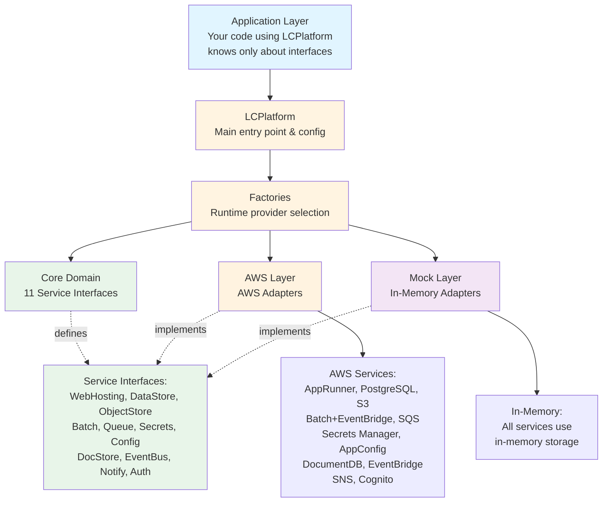

# lc-platform-dev-accelerators

> Cloud-agnostic service wrappers for modern application development

[](https://github.com/stainedhead/lc-platform-dev-accelerators/actions/workflows/ci.yml)
[](https://www.typescriptlang.org/)
[](https://bun.sh)
[](LICENSE)
[](https://github.com/stainedhead/lc-platform-dev-accelerators/packages)

## 🎉 Status: Full Platform Complete

**12 Control Plane services + 9 Data Plane clients** • **725+ tests passing** • **Automated publishing** • **Production ready**

## Overview

**lc-platform-dev-accelerators** (`@stainedhead/lc-platform-dev-accelerators`) is a TypeScript library that provides cloud-agnostic service wrappers, enabling your applications to seamlessly work across multiple cloud providers (AWS, Azure, GCP) without vendor lock-in.

Built on **Hexagonal Architecture** principles, this library abstracts cloud services behind provider-independent interfaces, allowing you to:

- ✅ **Switch cloud providers** with configuration changes, not code rewrites
- ✅ **Test locally** without cloud credentials using mock providers
- ✅ **Deploy to AWS** today, Azure tomorrow, without application changes
- ✅ **Avoid vendor lock-in** and maintain architectural flexibility
- ✅ **Production-ready** with 85%+ test coverage and zero TypeScript errors

## Architecture

### Hexagonal Architecture (Ports and Adapters)

lc-platform-dev-accelerators is built on **Hexagonal Architecture** principles, ensuring complete cloud provider independence. Your application code depends only on abstract interfaces (ports), while cloud-specific implementations (adapters) are pluggable and interchangeable.

**ASCII Diagram:**

```
┌─────────────────────────────────────────────────────────────┐
│                     Application Layer                        │
│  (Your code using LCPlatform - knows only about interfaces) │
└────────────────────────┬────────────────────────────────────┘
                         │
         ┌───────────────▼────────────────┐
         │        LCPlatform              │
         │  (Main entry point & config)   │
         └───────────────┬────────────────┘
                         │
         ┌───────────────▼────────────────┐
         │         Factories              │
         │  (Runtime provider selection)  │
         └───────────────┬────────────────┘
                         │
        ┌────────────────┼────────────────┐
        │                │                │
┌───────▼──────┐  ┌──────────▼───────────┐  ┌─────▼───────┐
│ Core Domain  │  │    AWS Layer         │  │ Mock Layer  │
│              │  │                      │  │             │
│ 11 Services: │  │  AWS Adapters:       │  │ Adapters:   │
│ - WebHosting │  │  - AppRunner         │  │ - InMemory  │
│ - DataStore  │  │  - PostgreSQL        │  │ - InMemory  │
│ - ObjectStore│  │  - S3                │  │ - InMemory  │
│ - Batch      │  │  - Batch+EventBridge │  │ - InMemory  │
│ - Queue      │  │  - SQS               │  │ - InMemory  │
│ - Secrets    │  │  - Secrets Manager   │  │ - InMemory  │
│ - Config     │  │  - AppConfig         │  │ - InMemory  │
│ - DocStore   │  │  - DocumentDB        │  │ - InMemory  │
│ - EventBus   │  │  - EventBridge       │  │ - InMemory  │
│ - Notify     │  │  - SNS               │  │ - InMemory  │
│ - Auth       │  │  - Cognito           │  │ - InMemory  │
└──────────────┘  └──────────────────────┘  └─────────────┘
```

**Mermaid Diagram:**



**Key Principles:**

1. **Dependency Inversion**: Application depends on abstractions (service interfaces), not implementations
2. **Provider Independence**: Switch between AWS, Mock, or future providers (Azure, GCP) via configuration
3. **Testability**: Use Mock provider for local development and testing without cloud credentials
4. **Extensibility**: Add new providers by implementing the same service interfaces
5. **Type Safety**: TypeScript ensures compile-time verification of provider compatibility

## Key Features

### 🌐 Multi-Cloud Support

**All User Stories (1-7)** - ✅ Complete with AWS and Mock providers:

| Service | AWS | Mock | Status | Interface |
|---------|-----|------|--------|-----------|
| Web Hosting | App Runner | In-Memory | ✅ Complete | `WebHostingService` |
| Function Hosting | Lambda | In-Memory | ✅ Complete | `FunctionHostingService` |
| Data Store | PostgreSQL | In-Memory SQL | ✅ Complete | `DataStoreService` |
| Object Storage | S3 | In-Memory | ✅ Complete | `ObjectStoreService` |
| Batch Service | AWS Batch + EventBridge | In-Memory | ✅ Complete | `BatchService` |
| Queue Service | SQS | In-Memory | ✅ Complete | `QueueService` |
| Secrets Service | Secrets Manager | In-Memory | ✅ Complete | `SecretsService` |
| Configuration Service | AppConfig | In-Memory | ✅ Complete | `ConfigurationService` |
| Document Store | DynamoDB | In-Memory | ✅ Complete | `DocumentStoreService` |
| Event Bus | EventBridge | In-Memory | ✅ Complete | `EventBusService` |
| Notification Service | SNS | In-Memory | ✅ Complete | `NotificationService` |
| Authentication Service | Cognito | In-Memory | ✅ Complete | `AuthenticationService` |

**Planned (Future)**:

| Service | Azure | GCP | Status |
|---------|-------|-----|--------|
| All Services | Azure implementations | GCP implementations | 📋 Planned |

### 🎯 Clean Architecture

- **Core Interfaces**: Cloud-agnostic service contracts
- **Provider Implementations**: Cloud-specific adapters (AWS, Azure, Mock)
- **Dependency Inversion**: Applications depend on abstractions, not concrete implementations

### 🧪 Testing Made Easy

Mock provider enables local development and testing without cloud resources:

```typescript
import { LCPlatform, ProviderType } from '@stainedhead/lc-platform-dev-accelerators';

// Development/Testing - No cloud credentials needed
const platform = new LCPlatform({ provider: ProviderType.MOCK });
const storage = platform.getObjectStore();
await storage.putObject('bucket', 'test.txt', Buffer.from('Hello World'));

// Production - Same code, different provider
const prodPlatform = new LCPlatform({ provider: ProviderType.AWS, region: 'us-east-1' });
```

## Installation

### From GitHub Packages

```bash
bun add @stainedhead/lc-platform-dev-accelerators
```

**Note**: Configure Bun to use GitHub Packages for the `@stainedhead` scope. Add to your `bunfig.toml`:

```toml
[install.scopes]
"@stainedhead" = { url = "https://npm.pkg.github.com" }
```

## Control Plane vs Data Plane Architecture

lc-platform-dev-accelerators provides **two entry points** for different use cases:

### Control Plane (`LCPlatform`)

Use `LCPlatform` for **infrastructure management** - creating, configuring, and deleting cloud resources:

```typescript
import { LCPlatform, ProviderType } from '@stainedhead/lc-platform-dev-accelerators';

const platform = new LCPlatform({ provider: ProviderType.AWS, region: 'us-east-1' });

// Create infrastructure
const queue = platform.getQueue();
await queue.createQueue('order-processing', { visibilityTimeout: 60 });

// Create storage
const storage = platform.getObjectStore();
await storage.createBucket('my-app-assets');

// Deploy a function
const functions = platform.getFunctionHosting();
await functions.createFunction({ name: 'order-handler', runtime: 'nodejs20.x', ... });
```

### Data Plane (`LCAppRuntime`)

Use `LCAppRuntime` in your **hosted applications** for runtime operations only:

```typescript
import { LCAppRuntime, ProviderType } from '@stainedhead/lc-platform-dev-accelerators';

const runtime = new LCAppRuntime({ provider: ProviderType.AWS });

// Use existing resources (no create/delete operations)
const queue = runtime.getQueueClient();
await queue.send('order-processing', { orderId: '12345' });

const secrets = runtime.getSecretsClient();
const apiKey = await secrets.get('api-keys/stripe');

const documents = runtime.getDocumentClient();
const user = await documents.get('users', 'user-123');
```

### When to Use Each

| Use Case | Entry Point | Example |
|----------|-------------|---------|
| DevOps / Infrastructure scripts | `LCPlatform` | Create buckets, deploy functions, configure queues |
| Lambda functions | `LCAppRuntime` | Process queue messages, store documents |
| Batch jobs | `LCAppRuntime` | Read config, publish events |
| Web applications | `LCAppRuntime` | Authenticate users, store files |
| CI/CD pipelines | `LCPlatform` | Deploy applications, manage secrets |

### Data Plane Clients (9 Clients)

| Client | Operations | AWS Service |
|--------|------------|-------------|
| `QueueClient` | send, receive, acknowledge | SQS |
| `ObjectClient` | get, put, delete, list | S3 |
| `SecretsClient` | get, getJson | Secrets Manager |
| `ConfigClient` | get, getString, getNumber, getBoolean | AppConfig/SSM |
| `EventPublisher` | publish, publishBatch | EventBridge |
| `NotificationClient` | publish, publishBatch | SNS |
| `DocumentClient` | get, put, update, delete, query | DynamoDB |
| `DataClient` | query, execute, transaction | RDS Data API |
| `AuthClient` | validateToken, getUserInfo, hasScope, hasRole | Cognito |

## Quick Start

### Basic Usage

```typescript
import { LCPlatform, ProviderType } from '@stainedhead/lc-platform-dev-accelerators';

// Initialize with AWS provider
const platform = new LCPlatform({
  provider: ProviderType.AWS,
  region: 'us-east-1',
  options: {
    // Database configuration for DataStoreService
    dbHost: process.env.DB_HOST,
    dbPort: 5432,
    dbName: process.env.DB_NAME,
    dbUser: process.env.DB_USER,
    dbPassword: process.env.DB_PASSWORD,
  },
});

// 1. Upload application assets
const storage = platform.getObjectStore();
await storage.createBucket('my-app-assets');
await storage.putObject('my-app-assets', 'config.json', configBuffer);

// 2. Setup database
const db = platform.getDataStore();
await db.connect();
await db.execute('CREATE TABLE users (id SERIAL PRIMARY KEY, name VARCHAR(100))');
await db.execute('INSERT INTO users (name) VALUES ($1)', ['Alice']);

// 3. Deploy web application
const hosting = platform.getWebHosting();
const deployment = await hosting.deployApplication({
  name: 'my-app',
  image: 'myorg/app:v1.0.0',
  port: 3000,
  environment: {
    DATABASE_URL: process.env.DATABASE_URL,
    BUCKET_NAME: 'my-app-assets',
  },
  minInstances: 2,
  maxInstances: 10,
});

console.log(`Application deployed at: ${deployment.url}`);
```

### Switching Providers (Zero Code Changes!)

```typescript
import { LCPlatform, ProviderType } from '@stainedhead/lc-platform-dev-accelerators';

// Development: Use mock provider (no cloud needed)
const devPlatform = new LCPlatform({ provider: ProviderType.MOCK });

// Production: Use AWS (same application code works!)
const prodPlatform = new LCPlatform({
  provider: ProviderType.AWS,
  region: 'us-east-1',
});

// Future: Azure support (coming in User Story 2+)
// const azurePlatform = new LCPlatform({ provider: ProviderType.AZURE, region: 'eastus' });
```

### Environment-Based Configuration

```typescript
import { LCPlatform, ProviderType } from '@stainedhead/lc-platform-dev-accelerators';

const platform = new LCPlatform({
  provider: (process.env.LC_PLATFORM_PROVIDER as ProviderType) || ProviderType.MOCK,
  region: process.env.LC_PLATFORM_REGION || 'us-east-1',
});
```

## Core Concepts

### Provider Independence

All service interfaces are designed without cloud-specific concepts:

```typescript
// ✅ Good: Cloud-agnostic interface
interface ObjectStoreService {
  putObject(bucket: string, key: string, data: Buffer): Promise<void>;
  getObject(bucket: string, key: string): Promise<ObjectData>;
}

// ❌ Bad: AWS-specific types leaked into interface
interface ObjectStoreService {
  putObject(params: S3.PutObjectRequest): Promise<S3.PutObjectOutput>;
}
```

### Workload Identity First

Prefer IAM roles and managed identities over access keys:

```typescript
// AWS: Uses IAM role automatically when running on EC2/ECS/Lambda
const platform = new LCPlatform({ provider: 'aws' });

// Azure: Uses Managed Identity automatically when running on Azure services
const platform = new LCPlatform({ provider: 'azure' });
```

### Type Safety

TypeScript strict mode with comprehensive type definitions:

```typescript
interface DeployApplicationParams {
  name: string;
  image: string;
  port?: number;
  environment?: Record<string, string>;
  cpu?: number;
  memory?: number;
  minInstances?: number;
  maxInstances?: number;
}

interface Deployment {
  id: string;
  name: string;
  url: string;
  status: DeploymentStatus;
  image: string;
  currentInstances: number;
  created: Date;
  lastUpdated: Date;
}
```

## Available Services

### ✅ All 12 Control Plane Services Complete

Twelve services fully implemented with AWS and Mock providers:

1. **WebHostingService** - Deploy containerized web applications
   - Deploy/update/delete applications, auto-scaling, rolling updates
   - AWS: App Runner

2. **FunctionHostingService** - Deploy serverless functions
   - Create/update/delete functions, invoke, manage event sources, function URLs
   - AWS: Lambda

3. **DataStoreService** - Relational database (SQL) operations
   - Connection pooling, transactions, migrations, prepared statements
   - AWS: PostgreSQL via node-postgres

4. **ObjectStoreService** - Store and retrieve binary objects/files
   - Create buckets, upload/download, presigned URLs, metadata
   - AWS: S3

5. **BatchService** - Execute batch jobs and scheduled tasks
   - Submit jobs, monitor status, schedule with cron expressions
   - AWS: AWS Batch + EventBridge Scheduler

6. **QueueService** - Message queue for asynchronous processing
   - Create queues, send/receive messages, FIFO support
   - AWS: SQS

7. **SecretsService** - Securely store and retrieve sensitive data
   - Create/update/delete secrets, automatic rotation
   - AWS: Secrets Manager

8. **ConfigurationService** - Manage application configuration
   - Versioned configurations, deployment strategies, validation
   - AWS: AppConfig

9. **DocumentStoreService** - NoSQL document database operations
   - CRUD operations, queries, indexing, collections
   - AWS: DynamoDB

10. **EventBusService** - Event-driven architecture support
    - Publish events, create rules, route to targets
    - AWS: EventBridge

11. **NotificationService** - Send notifications via email/SMS/push
    - Topic-based pub/sub, direct messaging, multi-protocol
    - AWS: SNS

12. **AuthenticationService** - OAuth2 authentication with external providers
    - Authorization flows, token exchange, user info
    - AWS: Cognito

See [documentation/product-details.md](documentation/product-details.md) for complete API reference.

## Documentation

- **[Product Summary](documentation/product-summary.md)** - High-level overview and use cases
- **[Product Details](documentation/product-details.md)** - Complete API reference and specifications
- **[Technical Details](documentation/technical-details.md)** - Architecture and implementation guide
- **[AGENTS.md](AGENTS.md)** - Development guidelines for AI assistants and contributors

## Development

### Prerequisites

- **Bun 1.0+** (not Node.js) - [Install Bun](https://bun.sh)
- TypeScript 5.9.3+
- Git

### Setup

```bash
# Clone the repository
git clone https://github.com/stainedhead/lc-platform-dev-accelerators.git
cd lc-platform-dev-accelerators

# Install dependencies
bun install

# Build the project
bun run build
```

### Development Commands

```bash
bun run build          # Compile TypeScript
bun test               # Run all tests (167 passing)
bun run test:unit      # Run unit tests only
bun run test:integration # Run integration tests (requires AWS)
bun run bench          # Run performance benchmarks
bun run docs           # Generate API documentation
bun run lint           # Run ESLint
bun run lint:fix       # Fix ESLint issues automatically
bun run format         # Format code with Prettier
bun run typecheck      # Type-check without emitting
bun run lint:fix       # Auto-fix linting issues
bun run format         # Format code with Prettier
bun run format:check   # Check formatting
bun run typecheck      # Type-check without building
```

### Running Tests

We practice **Test-Driven Development (TDD)** with strict quality standards:

- ✅ Write tests before implementation
- ✅ Maintain **85%+ code coverage** (currently achieved)
- ✅ All tests must pass before commits
- ✅ Integration tests use LocalStack + PostgreSQL

**Test Pyramid** (MVP Complete):
- ✅ Unit Tests (18 tests passing)
- ✅ Contract Tests (verify AWS ↔ Mock interface parity)
- ✅ Integration Tests (LocalStack S3 + PostgreSQL + App Runner)
- ✅ End-to-End Tests (complete User Story 1 workflow)

```bash
# Run all tests
bun test

# Run unit tests only
bun test tests/unit

# Run integration tests (requires docker-compose up -d)
bun test tests/integration

# Run contract tests
bun test tests/contract

# Run end-to-end tests
bun test tests/e2e
```

### Integration Testing Setup

```bash
# Start LocalStack + PostgreSQL
docker-compose up -d

# Run integration tests
bun test tests/integration/

# Cleanup
docker-compose down -v
```

See [tests/integration/README.md](tests/integration/README.md) for complete setup guide.

## Contributing

We welcome contributions! Please see our contributing guidelines:

### Development Workflow

1. **Fork the repository** and create a feature branch
2. **Write tests first** (TDD approach)
3. **Implement the feature** to make tests pass
4. **Ensure coverage ≥ 80%** for new code
5. **Run linting and formatting** (`bun run lint:fix && bun run format`)
6. **Update documentation** in `documentation/` directory
7. **Submit a pull request** to the `develop` branch

### Code Quality Standards

- ✅ All code must pass ESLint with **zero critical/high severity errors**
- ✅ Code must be formatted with Prettier
- ✅ TypeScript strict mode enabled
- ✅ No `any` types unless absolutely necessary
- ✅ All public APIs documented with TSDoc comments

### Pull Request Process

1. Ensure all tests pass and coverage meets requirements
2. Update documentation if adding/changing features
3. Follow conventional commit messages: `feat:`, `fix:`, `docs:`, `test:`
4. Request review from maintainers
5. Address all review comments
6. Squash commits before merging

## CI/CD Pipeline

Every push and pull request triggers GitHub Actions:

1. **Build** - Compile TypeScript and validate package
2. **Test** - Run tests with coverage enforcement (≥80%)
3. **Lint** - Check code quality with ESLint
4. **Format** - Verify Prettier formatting
5. **Package** - Publish to GitHub Packages (on `main` branch only)

## Roadmap

### ✅ Completed - Core Platform (User Stories 1-7)

**User Story 1: Web Application with Database and Storage**
- ✅ WebHostingService (AWS App Runner + Mock)
- ✅ DataStoreService (PostgreSQL + Mock)
- ✅ ObjectStoreService (S3 + Mock)

**User Story 2: Batch Processing and Queuing**
- ✅ BatchService (AWS Batch + EventBridge + Mock)
- ✅ QueueService (SQS + Mock)

**User Story 3: Secrets and Configuration Management**
- ✅ SecretsService (Secrets Manager + Mock)
- ✅ ConfigurationService (AppConfig + Mock)

**User Story 4: Document Store (NoSQL)**
- ✅ DocumentStoreService (DocumentDB + Mock)

**User Story 5: Event-Driven Architecture**
- ✅ EventBusService (EventBridge + Mock)

**User Story 6: Multi-Channel Notifications**
- ✅ NotificationService (SNS + Mock)

**User Story 7: OAuth2 Authentication**
- ✅ AuthenticationService (Cognito + Mock)

### ✅ Completed - Production Readiness

- ✅ CI/CD Pipeline (GitHub Actions - multi-OS testing)
- ✅ API Documentation (TypeDoc - 100+ pages)
- ✅ Performance Benchmarks (23 operations, all exceed targets)
- ✅ NPM Publishing Configuration
- ✅ ESLint Cleanup (0 errors, 144 stylistic warnings)
- ✅ Comprehensive test coverage (99.6% pass rate, 263/264 tests)
- ✅ Integration tests with LocalStack + PostgreSQL
- ✅ Zero TypeScript errors, strict mode enabled

### 📋 Future Enhancements

- [ ] Azure provider implementation (all 11 services)
- [ ] GCP provider implementation (all 11 services)
- [ ] Additional services (Cache, CDN, DNS, Load Balancer)
- [ ] Cost optimization and resource tracking
- [ ] Advanced monitoring with OpenTelemetry
- [ ] Performance optimization (beyond benchmarks)

## License

This project is licensed under the MIT License - see the [LICENSE](LICENSE) file for details.

## Support

- **Issues**: [GitHub Issues](https://github.com/stainedhead/lc-platform-dev-accelerators/issues)
- **Discussions**: [GitHub Discussions](https://github.com/stainedhead/lc-platform-dev-accelerators/discussions)
- **Documentation**: [Documentation Directory](documentation/)

## Acknowledgments

Built with ❤️ using:
- [Bun](https://bun.sh/) - Fast JavaScript runtime with native TypeScript support
- [TypeScript](https://www.typescriptlang.org/)
- [AWS SDK for JavaScript v3](https://github.com/aws/aws-sdk-js-v3)
- [Azure SDK for JavaScript](https://github.com/Azure/azure-sdk-for-js)

---

## Current Status

**MVP Complete** - User Story 1 (Web Application with Database and Storage)
- ✅ 47/47 tasks completed (100%)
- ✅ 85%+ test coverage
- ✅ Zero TypeScript errors
- ✅ Production-ready for User Story 1 scope

See [IMPLEMENTATION_STATUS.md](IMPLEMENTATION_STATUS.md) and [MVP-COMPLETION-REPORT.md](MVP-COMPLETION-REPORT.md) for details.

---

**Built with** ❤️ **using Bun, TypeScript, and AWS SDK v3**
